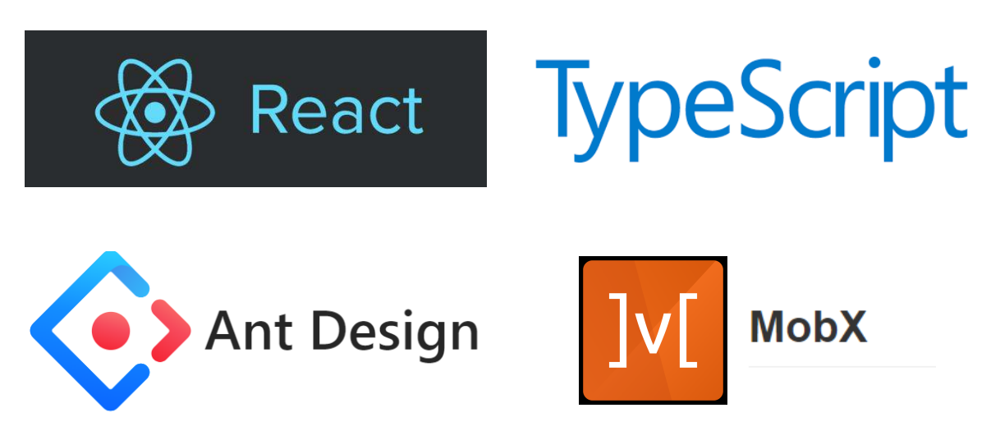

# React结合TypeScript和Mobx初体验



## 为什么要使用TypeScript

### 侦测错误

通过静态类型检测可以尽早检测出程序中隐藏的的逻辑错误，对于JavaScript动态的弱类型语言，虽然灵活性高，但是对于初学者来说，如果不熟悉JavaScript内部的语言机制，很容易造成隐藏的事故。但是通过TypeScript的静态类型检测可以规避这些问题，因为其能够约束变量产生的类型。结合IDE编辑器可以推导变量对应的类型以及内部的结构，提高代码的健壮性和可维护性。

### 抽象

类型系统能够强化规范编程，TypeScript提供定义接口。在开发大型复杂的应用软件时十分重要，一个系统模块可以抽象的看做一个TypeScript定义的接口。让设计脱离实现，最终体现出一种 IDL（接口定义语言，Interface Define Language），让程序设计回归本质。

### 文档

TypeScript可以自动根据类型标注生成文档，对于简单的功能实现都不需要编写注释。

## 为什么要使用Mobx

### MobX 和 Redux 的比较

先要明白 mobx 和 redux 的定位是不同的。redux 管理的是 (STORE -> VIEW -> ACTION) 的整个闭环，而 mobx 只关心 STORE -> VIEW 的部分。

Redux优缺点：

- 数据流流动很自然，因为任何 dispatch 都会触发广播，依据对象引用是否变化来控制更新粒度。

- 通过充分利用时间回溯的特征，可以增强业务的可预测性与错误定位能力。

- 时间回溯代价高，因为每次都要更新引用，除非增加代码复杂度，或使用 immutable。

- 时间回溯的另一个代价是 action 与 reducer 完全脱节，原因是可回溯必然不能保证引用关系。

- 引入中间件，解决异步带来的副作用，业务逻辑或多或少参杂着 magic。

- 灵活利用中间件，可以通过约定完成许多复杂的工作。

- 对 typescript 支持困难。

Mobx优缺点：

- 数据流流动不自然，只有用到的数据才会引发绑定，局部精确更新，但避免了粒度控制烦恼。

- 没有时间回溯能力，因为数据只有一份引用。自始至终一份引用，不需要 immutable，也没有复制对象的额外开销。

- 数据流动由函数调用一气呵成，便于调试。

- 业务开发不是脑力活，而是体力活，少一些 magic，多一些效率。

- 由于没有 magic，所以没有中间件机制，没法通过 magic 加快工作效率（这里 magic 是指 action 分发到 reducer 的过程）。

- 完美支持 typescript。

SO: 前端数据流不太复杂的情况，使用 Mobx，因为更加清晰，也便于维护；如果前端数据流极度复杂，建议谨慎使用 Redux，通过中间件减缓巨大业务复杂度

## 使用Create-React-App来建立TypeScript的环境

```bash
npm i -g create-react-app
create-react-app tinylog-ui --scripts-version=react-scripts-ts
cd tinylog-ui/
npm start
npm run eject
```

TPS: 最后一个命令使用eject将所有内建的配置暴露出来

通过create-react-app可以很方便地对整个项目完成环境初始化，如果愿意折腾TypeScript和webpack的环境可以试试，这里忽略webpack和TypeScript的环境搭建过程，而是使用create-react-app来实现环境搭建。

## 加入React-Router

单页应用怎么可以没有前端路由呢，所以我们要加入React-Rotuer, 这里使用的React-Router的版本是v4.2.0

### 路由配置使用姿势

对于React-Router，这里使用到的模块有Router, Route, Switch

>React Router 是建立在 history 之上的。 简而言之，一个 history 知道如何去监听浏览器地址栏的变化， 并解析这个 URL 转化为 location 对象， 然后 router 使用它匹配到路由，最后正确地渲染对应的组件。

代码如下：

```tsx
import * as React from 'react';
import * as ReactDOM from 'react-dom';
import { Router, Route, Switch } from 'react-router';
import { createBrowserHistory } from 'history';
import registerServiceWorker from './registerServiceWorker';
import { Root } from './containers/Root';
import './index.css';
import Container from './containers/Container';
import SignIn from './containers/Auth/signIn';
import SignUp from './containers/Auth/signUp';

const history = createBrowserHistory();

ReactDOM.render(
  <Root>
    <Router history={history}>
      <Switch>
        <Route
          path="/signIn"
          component={SignIn}
        />
        <Route
          path="/signUp"
          component={SignUp}
        />
        <Route
          path="/"
          component={Container}
        />
      </Switch>
    </Router>
  </Root>,
  document.getElementById('root') as HTMLElement
);
registerServiceWorker();

```
### 页面的编写

这里描述一写Container这个组件的编写

```tsx
import * as React from 'react';
import Header from '../../layout/Header';
import { IAuth } from '../../interfaces';
import { Route, Switch } from 'react-router';
import App from '../App';
import Website from '../Website';

// 这部分是坑点，一开始不知道配置，后发现react-rotuer的4.0版本下需要配置prop的接口
interface Container extends RouteComponentProps<{}> {
}

class Container extends React.Component<Container, {}> {
  render () {
    return (
      <div>
        <Header {...this.props} />
        <Switch>
          <Route path="/website" component={Website}/>
          <Route  path="/" component={App}/>
        </Switch>
      </div>
    )
  }
}

export default Container;
```

这样，当我们访问url为'/'的时候，默认会进入Container，其中Container里面是一层子页面，会匹配url，如果url为'/website', 则进入Website页面，若为'/',则进入App页面。

具体关于React-Router的使用请阅读[React-Router文档](https://reacttraining.com/react-router/)

## 加入Mobx

```bash
npm i mobx react-mobx mobx-react-router -S 
```

### 重新修改index.tsx的入口配置

```tsx
import * as React from 'react';
import * as ReactDOM from 'react-dom';
import { Router, Route, Switch } from 'react-router';
import { createBrowserHistory } from 'history';
import { useStrict } from 'mobx';
import { Provider } from 'mobx-react';
import { RouterStore, syncHistoryWithStore } from 'mobx-react-router';
// 定义需要使用到的store来进行数据状态的管理
import { 
  TokenStore, 
  AuthStore, 
  HostStore, 
  OverViewStore,
  AssetsStore,
  CommonDataStore,
  PageStore,
  RealTimeStore  
} from './stores';
import registerServiceWorker from './registerServiceWorker';
import { Root } from './containers/Root';
import './index.css';
import Container from './containers/Container';
import SignIn from './containers/Auth/signIn';
import SignUp from './containers/Auth/signUp';
// 引入Echarts
import './macarons';
import 'echarts/map/js/world';

// 开启mobx的严格模式，规范数据修改操作只能在action中进行
useStrict(true);

const browserHistory = createBrowserHistory();
const routerStore =  new RouterStore();
// 同步路由与mobx的数据状态
const history = syncHistoryWithStore(browserHistory, routerStore);
const rootStore = {
  token: new TokenStore(),
  auth: new AuthStore(),
  host: new HostStore(),
  overview: new OverViewStore(),
  assets: new AssetsStore(),
  commmon: new CommonDataStore(),
  page: new PageStore(),
  realtime: new RealTimeStore(),
  router: routerStore
};

ReactDOM.render(
  <Provider {...rootStore}>
    <Root>
      <Router history={history}>
        <Switch>
          <Route
            path="/signIn"
            component={SignIn}
          />
          <Route
            path="/signUp"
            component={SignUp}
          />
          <Route
            path="/"
            component={Container}
          />
        </Switch>
      </Router>
    </Root>
  </Provider>,
  document.getElementById('root') as HTMLElement
);
registerServiceWorker();
```

### Container容器的修改

```tsx
import * as React from 'react';
import Header from '../../layout/Header';
import { IAuth } from '../../interfaces';
import { Route, Switch } from 'react-router';
// 使用inject和observer来进行数据监听和数据依赖声明
import { inject, observer } from 'mobx-react';
import App from '../App';
import Website from '../Website';

interface Container extends IAuth {
}

@inject('router', 'auth')
@observer
class Container extends React.Component<Container, {}> {
  render () {
    return (
      <div>
        <Header {...this.props} />
        <Switch>
          <Route path="/website" component={Website}/>
          <Route  path="/" component={App}/>
        </Switch>
      </div>
    )
  }
}

export default Container;
```

> @observable 可以在实例字段和属性 getter 上使用。 对于对象的哪部分需要成为可观察的，@observable 提供了细粒度的控制。

> @inject 相当于Provider 的高阶组件。可以用来从 React 的context中挑选 store 作为 prop 传递给目标组件

### 组件的接口定义

```ts
import { RouteComponentProps } from 'react-router';
import {
  RouterStore,
  AuthStore
} from '../stores';

export interface IBase extends RouteComponentProps<{}> {
  router: RouterStore;
}

export interface IAuth extends IBase {
  auth: AuthStore;
}

```

### Store的配置

先看一下RouterStore:

```ts
import { History } from 'history';
import { RouterStore as BaseRouterStore, syncHistoryWithStore } from 'mobx-react-router';

// 路由状态同步
class RouterStore extends BaseRouterStore {
  public history;
  constructor(history?: History) {
    super();
    if (history) {
      this.history = syncHistoryWithStore(history, this);
    }
  }
}

export default RouterStore;
```

然后是AuthStore:

```ts
import { ISignIn, ISignUp } from './../interfaces/index';
import { observable, action } from 'mobx';
import api from '../api/auth'; 
import { IUser } from '../models';

// 登录注册状态
class AuthStore {
  @observable token;
  @observable id;
  @observable email;
  constructor () {
    this.id = '';
    this.token = '';
    this.email = '';
  }
  setLocalStorage ({ id, token, email }: IUser) {
    localStorage.setItem('id', id);
    localStorage.setItem('token', token);
    localStorage.setItem('email', email);
  }
  clearStorage () {
    localStorage.clear();
  }
  @action async signIn (data: ISignIn) {
    try {
      const { data: res } = await api.signIn(data);
      this.id = res.data.id;
      this.token = res.data.token;
      this.email = res.data.email;
      this.setLocalStorage({
        id: this.id,
        token: this.token,
        email: this.email
      });
      return res;
    } catch (error) {
      return error;
    }
  }
  
  @action async signUp (data: ISignUp) {
    try {
      const { data: res } = await api.signUp(data);
      this.id = res.data.id;
      this.token = res.data.token;
      this.email = res.data.email;
      this.setLocalStorage({
        id: this.id,
        token: this.token,
        email: this.email
      });
      return res;
    } catch (error) {
      return error;
    }
  }

  @action signOut () {
    this.id = '';
    this.token = '';
    this.email = '';
    this.clearStorage()
  }
}

export default AuthStore;
```

Auth是用于网站的登录注册事件以及对应的Token的数据状态保存，登录注册事件的接口请求等操作。


具体的有关Mobx的用法请阅读[Mobx文档](https://cn.mobx.js.org/)

## 目录结构

```
app
├── api             后端提供的接口数据请求
├── components      编写的可复用组件
├── config          侧边栏以及导航栏配置
├── constants       常量编写
├── interfaces      接口编写
├── layout          布局外框
├── stores          mobx的数据状态管理
├── index.css       全局样式
├── index.tsx       页面入口
├── reset.css       浏览器重置样式

```

本项目使用了Ant-Design来作为依赖的组件库，具体怎么使用以及配置请参考[Ant-Design](https://ant.design/docs/react/use-in-typescript-cn)

到这里其实以及完成对React下TypeScript结合React-Router和Mobx的配置。具体的业务模块如何编写有兴趣可以参阅项目[tinylog-ui](https://github.com/tinylog/tinylog-ui)


个人表达能力有限，无法描述得太清晰，请见谅！